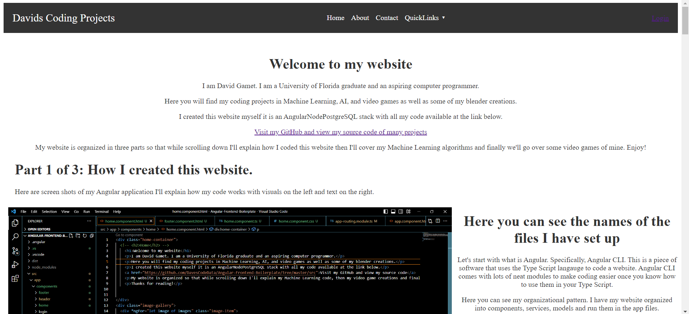

# Davids-Website

This is a work in progress but Angular CLI makes the work go a lot faster.

Hi, I am creaing this website to display to recruiters in the feild of programming my growing talents in coding.

This is the source code for a website I am developing. Here you will find explanations on how I organized and coded this website. Followed by how I set up a NodeJS server for the backend and you will be able to see my SQL commands for my PostgreSQL connection. I will have pictures and visuals explaning my code. Then I will begin covering machine learning algorithms I have created and have screen shots going over my code for tensorflow models. Finally, I will finish by explaining how I coded my video games and have a short explanation of my Blender creations that I made for the video game developments. Thanks for reading!

# Run the Frontend

To run this development platfrom for my website follow these instructions

Step 1: After creating a copy of this repository and opening it type in the terminal: `npm install -g @angular/cli` This will install the Angular packages.

If you don't know how to open the terminal and you are using VS Code just press `ctrl + backtick` 

Step 2: Add Angular materials by typing in the terminal: `ng add @angular/material`

Step 3: Run the development on your device by typing in the terminal: `ng build`

The development portion of the frontend of you project should now be working.

Step 4: Go to localhost://4200

You can now view the website and start making your own adjustments in the source code of this developer project.

When you develop something you like you can create a full stack development with a Node server.

Go to https://github.com/DavesCodeData/Node-Boilerplate.git and follow the README.md file to create a fullstack deployment.